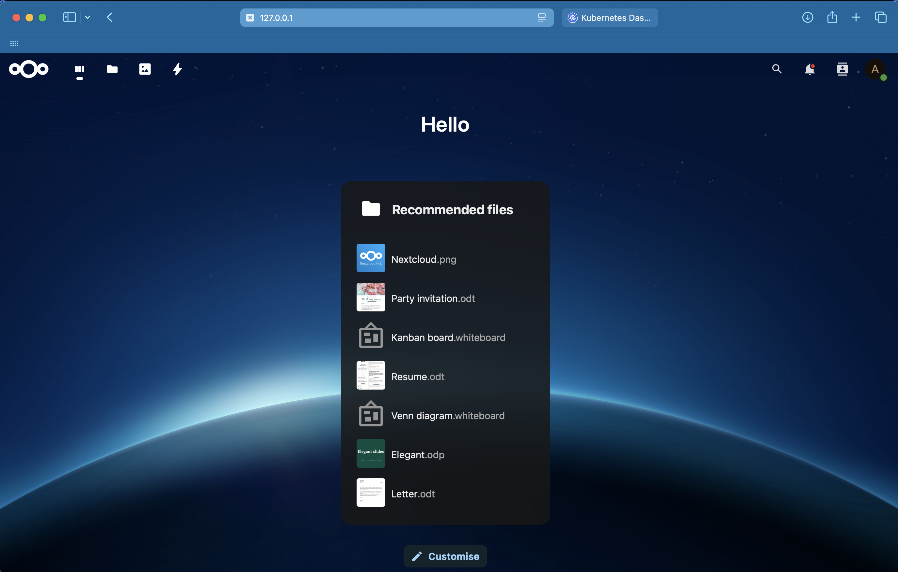
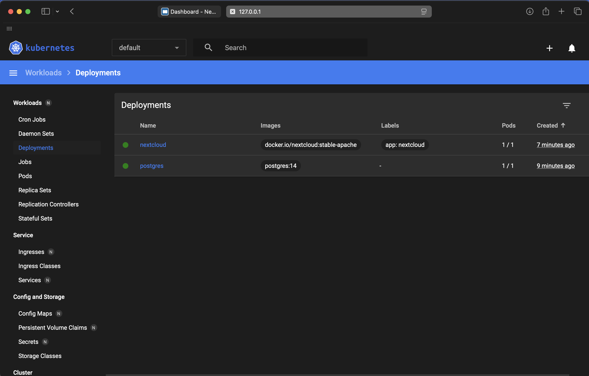

## Ход работы
Все манифесты находятся в директории k8s

Все конфигмапы,сервисы и деплойменты находятся в двух файлах:
- nextcloud.yaml
- postgres.yaml

Секреты вынесены в отдельные файлы, которые могут быть включены в .gitignore в случае реального сервиса:
- nextcloud-secret.yaml
- postgres-secret.yaml

создание постгреса
```sh
kubectl create -f postgres.yaml
```

создание некстклауда
```sh
kubectl create -f nextcloud.yaml
```
для удобства повторного запуска вместо expose deployment написал service в манифесте некстклауда

пруфы работоспособности манифестов

Скриншот веб-интерфейса некстклауда


Скриншот морды minikube, раздел deployments


## Ответы на вопросы

1. Важен ли порядок выполнения манифестов при создании деплоймента постгреса?

Порядок выполнения манифестов важен:
    - сначала создаем конфигмапу, в которой содержатся креды для постгреса
    - затем описываем service - сетевой конфиг постгреса
    - в конце создаем непосредственно deployment, который использует предыдущие манифесты

2. Что (и почему) произойдет, если отскейлить количество реплик postgres-deployment в 0, затем обратно в 1, после чего попробовать снова зайти на Nextcloud?

БД сбросится, под postgres эфемерный. Из-за этого некстклауд перестанет подниматься, потому что при сбросе бд сгинули все его данные

Для решения данной проблемы было решено создать PersistantVolume для постгреса.
- postgres-pv.yaml: манифест PersistantVolume
- postgres-pvc.yaml: манифест PersistantVolumeClaim для вольюма
