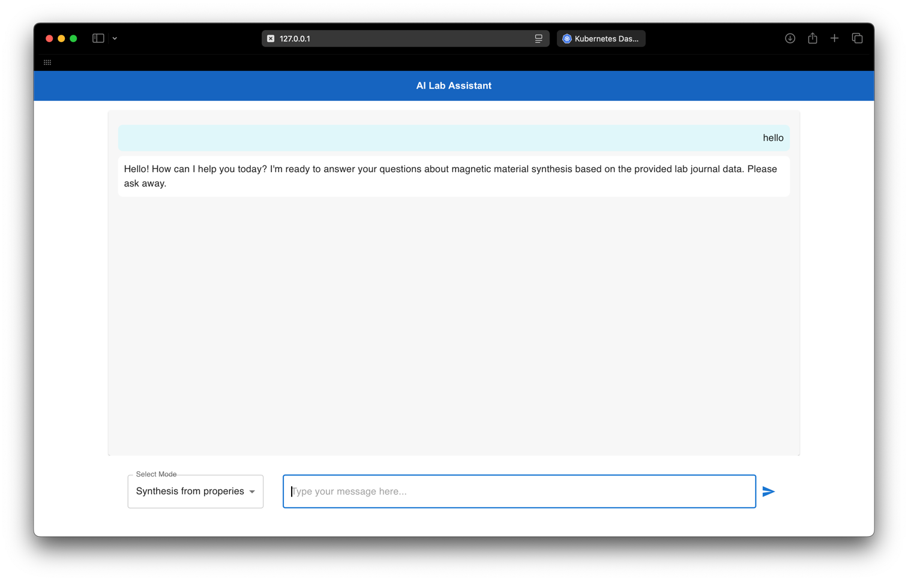

# Предыстория
Приложение - бекенд для общения с Gemini (lore - ИИ химик ассистент, который нужен для планирования химических синтезов)

# Ход работы
1. Два Deployment:
- один для minio
- один для backend-части

2. Кастомные images:
- aichem-chat: image бекенд-части
- minio-starter: image init-контейнера для minio

3. Deployment minio содержит init-контейнер
4. Deployment minio также содержит volume
5. backend и minio используют и configmaps, и secrets
6. Services в обоих Deployment
7. livenessProbe в Deployment minio
8. Label у обоих Deployment

Все манифесты в директории k8s

Работоспособность бэкенд сервиса

Работоспособность minio сервиса

Дашборд minikube

